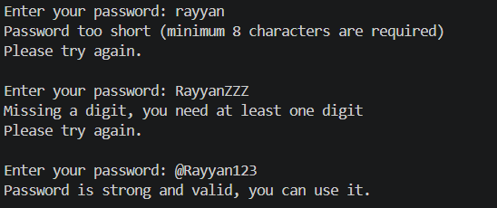

#  SafeLog Password Validator (Core Java)

# Problem Statement

In many organizations, weak passwords can lead to serious security risks. A cybersecurity firm requires a reliable system for its Employee Portal to ensure that all users create strong and secure passwords.

The task is to develop a Password Strength Validator using Core Java that checks whether a given password meets specific security criteria. The system should verify that the password is at least 8 characters long, contains at least one uppercase letter, and includes at least one numeric digit.

Instead of simply marking passwords as valid or invalid, the program must provide clear feedback indicating the exact reason for failure (such as "too short" or "missing a digit"). Additionally, the system should repeatedly prompt the user to enter a password until all conditions are satisfied.

The goal is to implement this using fundamental Java concepts like loops, string manipulation, and conditional logic.

##  Overview

This project is a simple **Password Strength Checker** built using Core Java.
It simulates a real-world requirement where a company wants employees to create strong and secure passwords for their internal portal.

Instead of just accepting or rejecting a password, this program clearly tells the user **what is missing** and keeps asking until a valid password is entered.

---

##  Features

* Checks if password length is at least 8 characters
* Ensures at least one uppercase letter is present
* Ensures at least one numeric digit is included
* Gives **specific feedback** (not just "invalid")
* Uses loops to continuously prompt the user until a valid password is entered

---

##  Technologies Used

* Java (Core Java concepts)
* String handling
* Loops (`for`, `while`)
* Conditional statements
* `Scanner` class for user input

---

##  How It Works

1. The user is asked to enter a password.
2. The program checks:

   * Length of the password
   * Presence of uppercase letters
   * Presence of digits
3. If any rule is not satisfied, it prints the exact issue.
4. The user is prompted again until the password is valid.

---

##  File Structure

```
PasswordValidator.java
README.md
```

---

##  How to Run

1. Open terminal / command prompt
2. Compile the program:

```
javac PasswordValidator.java
```

3. Run the program:

```
java PasswordValidator
```

---

##  Example
```
Enter your password: asdfg
Password too short (minimum 8 characters are required)
Please try again.

Enter your password: adsgdjbfkf
Missing an uppercase letter, you need at least one uppercase letter
Please try again.

Enter your password: RayyanZZZ
Missing a digit, you need at least one digit
Please try again.

Enter your password: Rayyan903
Password is strong and valid, you can use it.

```
---

## 📸 Output Screenshot



---
##  Outcomes

* Understanding string traversal using loops
* Using built-in methods like `Character.isUpperCase()` and `Character.isDigit()`
* Writing modular code using methods
* Implementing user input validation logic

---

##  Author

Rayyan A

BE CSE (AIML)

Email: rayyanibnrahman903@gmail.com
---


